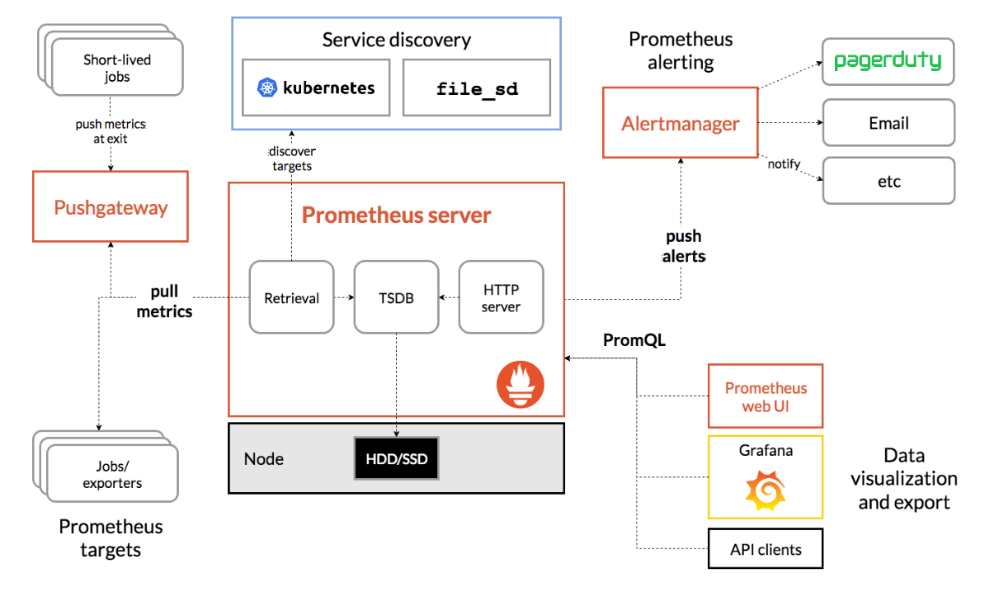

# Intro to prometheus

## The big picture

- Prometheus is an open source monitoring and alerting toolkit for gathering and processing data locally

_Open up prometheus homepage_

## Applications
- you can use it to monitor hardware utilisation such as the available memory or CPU utilisation of your machines
- you can use it to 

## How it works


### Diagram
_Show diagram of how it works_

- prometheus pulls in metrics periodically from different targets
- there is a key configuration file called `prometheus.yml` where you specify what prometheus scrapes amongst other things
- prometheus stores these metrics locally
- and you can query these metrics from the web UI, grafana, or the API
- prometheus can also be used to trigger alerts

## Key features
- All metrics are stored locally, so monitoring continues to work even when the network goes down
- as long as you can access the machine, you'll be able to access the metrics
- every metric stored by prometheus is timestamped

## 
- we can pull a container from docker hub that runs prometheus

```
docker pull prom/prometheus
```

- now we just need to create a configuration file before we run it

- i've got a basic configuration file right here
- what does it do?
- we've got some global parameters
- these configurations can get a lot more complicated
- but we'll leave it like this for now

- using this config file, we can run prometheus in a container

```
docker run --rm -p 9090:9090 --name prometheus -v /path/to/prometheus.yml:/etc/prometheus prom/prometheus --config.file=/etc/prometheus/prometheus.yml --web.enable-lifecycle 
```

- this command 

- now we can query the metrics using prometheus' query language promql


## Configuration

### Jobs and instances

- an instance is an endpoint that you can pull metrics from, like a docker container
- a job is a collection of the same instances, like a group of containers

## Querying data

### Metrics

#### Counter

#### Gauge

#### Histogram

#### Summary

### Functions

